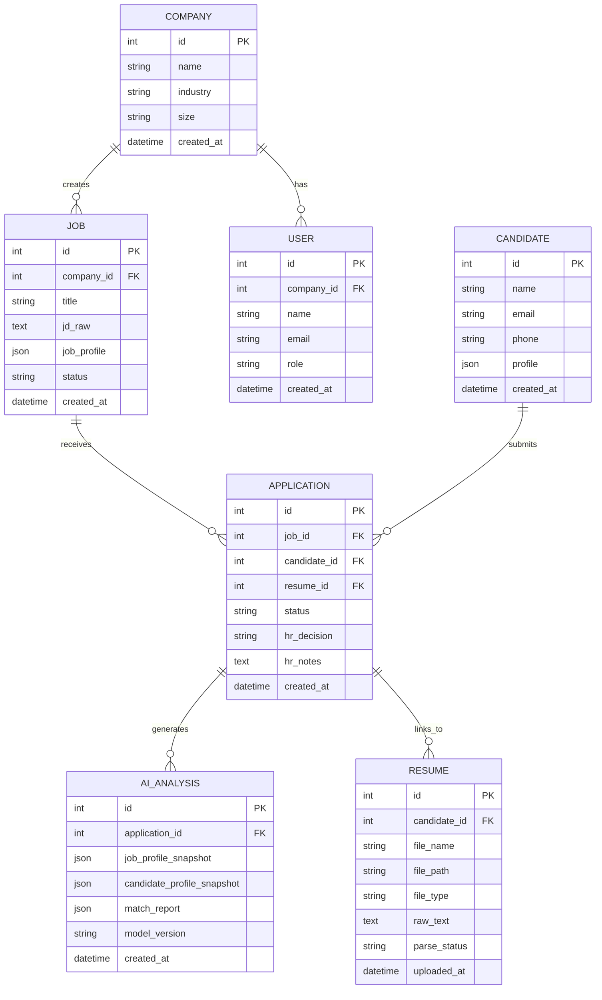

# 05 — 数据模型

## ER 图



## V1 实际建表 SQL

> 注意：V1 为单实例模式，`company_id` 和 `user_id` 字段保留但暂不启用。所有数据默认属于同一公司。

### company

```sql
CREATE TABLE company (
    id          INTEGER PRIMARY KEY AUTOINCREMENT,
    name        TEXT NOT NULL,
    industry    TEXT,
    size        TEXT,
    created_at  DATETIME DEFAULT CURRENT_TIMESTAMP
);
```

### job — 岗位

```sql
CREATE TABLE job (
    id          INTEGER PRIMARY KEY AUTOINCREMENT,
    company_id  INTEGER DEFAULT 1,
    title       TEXT NOT NULL,
    jd_raw      TEXT,
    job_profile JSON,
    status      TEXT DEFAULT 'active',
    created_at  DATETIME DEFAULT CURRENT_TIMESTAMP,
    updated_at  DATETIME DEFAULT CURRENT_TIMESTAMP,
    FOREIGN KEY (company_id) REFERENCES company(id)
);
```

**job_profile JSON 结构：**

```json
{
  "responsibilities": ["需求分析", "产品设计", "跨团队协作"],
  "required_skills": ["AI/ML基础", "产品需求分析", "项目管理"],
  "skill_tags": ["AI应用", "产品设计", "LLM", "Agent"],
  "experience_requirements": {
    "years_min": 3,
    "industry": ["互联网", "企业服务"],
    "preferred": ["AI产品经验"]
  },
  "weight_distribution": {
    "ai_understanding": 40,
    "product_ability": 30,
    "project_experience": 20,
    "education": 10
  },
  "screening_rules": []
}
```

### candidate — 候选人

```sql
CREATE TABLE candidate (
    id          INTEGER PRIMARY KEY AUTOINCREMENT,
    name        TEXT NOT NULL,
    email       TEXT,
    phone       TEXT,
    profile     JSON,
    created_at  DATETIME DEFAULT CURRENT_TIMESTAMP,
    updated_at  DATETIME DEFAULT CURRENT_TIMESTAMP
);
```

**profile JSON 结构（Candidate Profile）：**

```json
{
  "name": "张三",
  "years_of_experience": 5,
  "highest_degree": "硕士",
  "current_position": "高级产品经理",
  "current_company": "XX科技",
  "skills": ["AI Agent", "Python", "产品设计", "项目管理", "LLM应用"],
  "work_experience": [
    {
      "company": "XX科技",
      "position": "高级产品经理",
      "start_date": "2023-01",
      "end_date": "至今",
      "projects": [
        {
          "name": "企业AI助手平台",
          "description": "从0到1搭建AI助手产品，服务500+企业客户",
          "highlights": ["设计Agent工作流编排功能"]
        }
      ]
    }
  ],
  "education": [
    {
      "school": "北京大学",
      "degree": "硕士",
      "major": "计算机科学与技术",
      "start_year": 2019,
      "end_year": 2021
    }
  ]
}
```

### resume — 简历文件

```sql
CREATE TABLE resume (
    id              INTEGER PRIMARY KEY AUTOINCREMENT,
    candidate_id    INTEGER,
    file_name       TEXT NOT NULL,
    file_path       TEXT NOT NULL,
    file_type       TEXT DEFAULT 'pdf',
    raw_text        TEXT,
    parse_status    TEXT DEFAULT 'pending',
    parse_error     TEXT,
    created_at      DATETIME DEFAULT CURRENT_TIMESTAMP,
    FOREIGN KEY (candidate_id) REFERENCES candidate(id)
);
```

**parse_status 状态流转：**

```
pending → parsing → completed
                 → failed → retrying → parsing
```

### application — 申请记录

```sql
CREATE TABLE application (
    id              INTEGER PRIMARY KEY AUTOINCREMENT,
    job_id          INTEGER NOT NULL,
    candidate_id    INTEGER NOT NULL,
    resume_id       INTEGER,
    status          TEXT DEFAULT 'new',
    hr_decision     TEXT,
    hr_notes        TEXT,
    created_at      DATETIME DEFAULT CURRENT_TIMESTAMP,
    updated_at      DATETIME DEFAULT CURRENT_TIMESTAMP,
    FOREIGN KEY (job_id) REFERENCES job(id),
    FOREIGN KEY (candidate_id) REFERENCES candidate(id),
    FOREIGN KEY (resume_id) REFERENCES resume(id)
);
```

**status 状态流转：**

```
new → ai_screened → hr_reviewed → contacting → interviewing → offered → hired
                                 → rejected
```

**hr_decision 可选值：**

```
pending | suitable | maybe | not_suitable
```

### ai_analysis — AI 分析记录

```sql
CREATE TABLE ai_analysis (
    id                          INTEGER PRIMARY KEY AUTOINCREMENT,
    application_id              INTEGER NOT NULL,
    job_profile_snapshot        JSON,
    candidate_profile_snapshot  JSON,
    match_report                JSON,
    model_version               TEXT,
    created_at                  DATETIME DEFAULT CURRENT_TIMESTAMP,
    FOREIGN KEY (application_id) REFERENCES application(id)
);
```

**match_report JSON 结构：**

```json
{
  "overall_conclusion": "推荐进入初面",
  "star_rating": 4,
  "summary": "张三的AI产品经验和产品设计能力与本岗位高度匹配...",
  "strengths": [
    {
      "point": "有AI项目实战经验",
      "evidence": "从0到1搭建企业AI助手平台，与岗位AI产品方向匹配"
    }
  ],
  "gaps": [
    {
      "point": "缺少B端SaaS经验",
      "evidence": "简历中没有体现面向企业客户的SaaS产品经验"
    }
  ],
  "interview_suggestions": [
    "了解他对AI产品商业化的看法",
    "考察跨团队协作的具体案例"
  ],
  "dimension_scores": {
    "ai_understanding": "high",
    "product_ability": "mid_high",
    "project_experience": "high",
    "education": "match"
  }
}
```

## 关键设计决策

### 为什么 Candidate 和 Application 分开？

- **Candidate** 是人，一个真实的人可能申请多个岗位
- **Application** 是行为，记录对特定岗位的申请
- 分离后：候选人画像可以跨岗位复用，历史申请记录可追溯

### 为什么 AI Analysis 存储快照？

- `job_profile_snapshot` 和 `candidate_profile_snapshot` 记录分析时的状态
- 因为 Job Profile 和 Candidate Profile 后续可能被编辑
- 快照保证 Match Report 的可追溯性——"当时是基于什么数据分析的"

### 为什么用 JSON 字段而不是拆表？

- V1 阶段 Job Profile 和 Candidate Profile 的结构在迭代中
- SQLite 的 JSON 字段提供灵活性，避免频繁改表
- 后续 V2/V3 可将高频查询字段拆为独立列，JSON 保留完整数据
